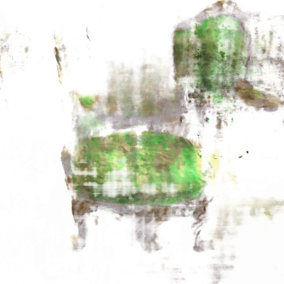
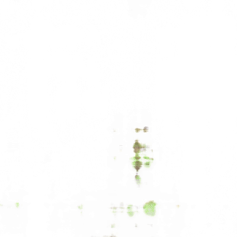
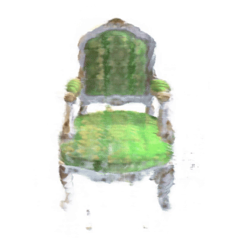
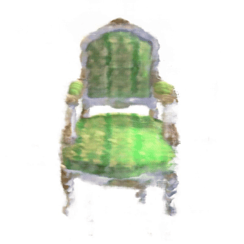

<div align=center>
  
# Bayesian NeRF: Quantifying Uncertainty with Volume Density for Neural Implicit Fields

Sibaek Lee, Kyeongsu Gang, Seongbo Ha, Hyeonwoo Yu

[Paper](https://arxiv.org/abs/2404.06727) | [Video](https://youtu.be/wp5jW4S_jqo)

</div>

## Overview
We present the Bayesian Neural Radiance Field (NeRF), which explicitly quantifies uncertainty in geometric volume structures without the need for additional networks, making it adept for challenging observations and uncontrolled images. 

## Video Result
The results have been adjusted to account for the uncertainty in (Far Left) Base, (Left-Center) Color, (Center) Density, (Right-Center) Density and Color, and (Far Right) Occupancy.




<br/> 

## Enviroment Setting
```bash
cd Bayesian_NeRF
conda create --name bayesian_nerf python=3.8
conda activate bayesian_nerf
pip install -r requirements.txt
```

```bash
sudo apt-get update
sudo apt-get install -y libgl1-mesa-glx
sudo apt-get install -y libglib2.0-0
```
<br/> 


# NeRF Implementation


## Dataset setting
- Synthetic data (Blender) and real-world data (LLFF) : [NeRF dataset](https://drive.google.com/drive/folders/128yBriW1IG_3NJ5Rp7APSTZsJqdJdfc1).
- Modelnet Dataset : [ModelNet dataset](https://modelnet.cs.princeton.edu/)


Our proposed method excels in scenarios with limited data, hence we recommend downloading the dataset and appropriately processing it for experimentation.


## Running the example data (chair scene 4 images)
```bash
# copy sample dataset to each method folder
cd NeRF
cp -r NeRF_for_rgb_img/NeRF_baseline/data NeRF_for_rgb_img/NeRF_color/
cp -r NeRF_for_rgb_img/NeRF_baseline/data NeRF_for_rgb_img/NeRF_density/
cp -r NeRF_for_rgb_img/NeRF_baseline/data NeRF_for_rgb_img/NeRF_density_and_color/
cp -r NeRF_for_rgb_img/NeRF_baseline/data NeRF_for_rgb_img/NeRF_occupancy/
```

<br>

```bash
cd NeRF_for_rgb_img

cd NeRF_baseline
python run_nerf.py --config configs/synthetic.txt --expname ../../chair/4_baseline --datadir ./data/nerf_synthetic/chair_4
cd ..

cd NeRF_color
python run_nerf.py --config configs/synthetic.txt --expname ../../chair/4_color --datadir ./data/nerf_synthetic/chair_4
cd ..

cd NeRF_density
python run_nerf.py --config configs/synthetic.txt --expname ../../chair/4_density --datadir ./data/nerf_synthetic/chair_4
cd ..

cd NeRF_density_and_color
python run_nerf.py --config configs/synthetic.txt --expname ../../chair/4_den_col --datadir ./data/nerf_synthetic/chair_4
cd ..

cd NeRF_occupancy
python run_nerf.py --config configs/synthetic.txt --expname ../../chair/4_occupancy --datadir ./data/nerf_synthetic/chair_4
cd ..

cd ..

```


## Running the code

- RGB img
```bash
cd NeRF_for_rgb_img

cd [Method Name]
python run_nerf.py --config configs/synthetic.txt --expname <Output Path> --datadir <Dataset Path>
cd ../..
```


- Depth img
```bash
cd NeRF_for_depth_img
python <Method.py> --config configs/coarse.txt --expname <Output Path> --datadir <Dataset Path>
cd ../..
```

 <br/>  <br/> 


# SLAM Implementation 


## Download
```bash
bash scripts/download_replica.sh # download replica dataset
bash scripts/download_tum.sh # download tum dataset
bash scripts/download_cull_replica_mesh.sh # for reconsturction evaluation
```

## Preprocess Data
You can use `data_delete_replica.py` and `data_delete_tum.py` to retain only specific indices in the dataset.

## Run & Evaluation
```bash
# (Replica) Origianl method
python -W ignore run.py configs/Replica/room0.yaml
python src/tools/eval_recon.py --rec_mesh output/Replica/room0/mesh/final_mesh_eval_rec.ply --gt_mesh cull_replica_mesh/room0.ply -2d -3d -txt_name output/Replica/room0/result.txt
python src/tools/eval_ate.py configs/Replica/room0.yaml --txt_name output/Replica/room0/result.txt

# (Replica) Uncertainty method
python -W ignore run.py configs/Replica/room0_uncert.yaml --uncert
python src/tools/eval_recon.py --rec_mesh output/Replica/room0_uncert/mesh/final_mesh_eval_rec.ply --gt_mesh cull_replica_mesh/room0.ply -2d -3d -txt_name output/Replica/room0_uncert/result.txt
python src/tools/eval_ate.py configs/Replica/room0_uncert.yaml --txt_name output/Replica/room0_uncert/result.txt
```

```bash
# (TUM) Origianl method
python -W ignore run.py configs/TUM_RGBD/freiburg1_desk.yaml
python src/tools/eval_ate.py configs/TUM_RGBD/freiburg1_desk.yaml --txt_name output/TUM_RGBD/freiburg1_desk/result.txt

# (TUM) Uncertainty method
python -W ignore run.py configs/TUM_RGBD/freiburg1_desk_uncert.yaml --uncert
python src/tools/eval_ate.py configs/TUM_RGBD/freiburg1_desk_uncert.yaml --txt_name output/TUM_RGBD/freiburg1_desk_uncert/result.txt
```


## Acknowledgements
This implementation is based on [Vanila NeRF](https://github.com/bmild/nerf) and [NICE-SLAM](https://github.com/cvg/nice-slam/tree/master).
